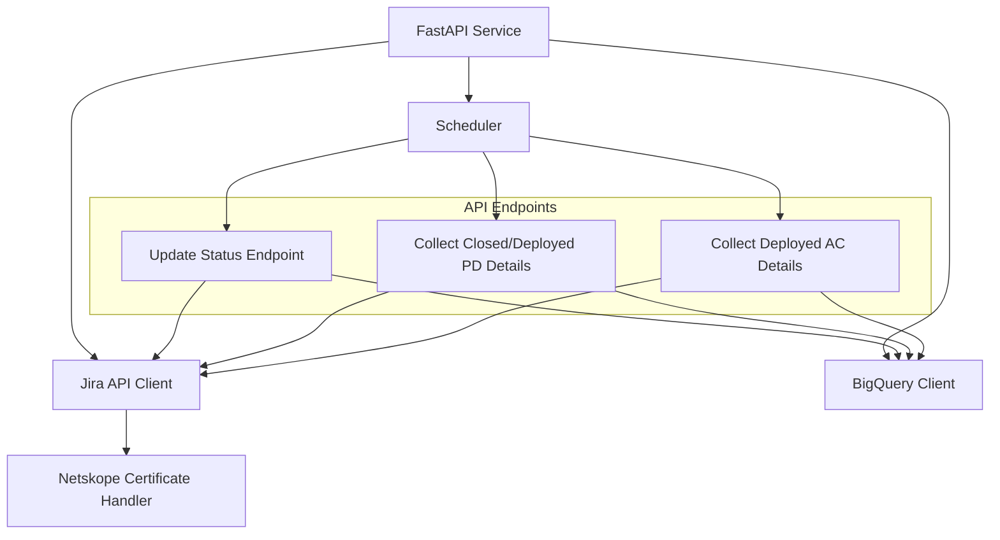

# Jira Logger with BigQuery Integration - Implementation Plan

This document outlines the comprehensive plan to implement a FastAPI service that will handle Jira issue tracking with BigQuery integration.

## System Architecture



## Components Overview

### 1. FastAPI Service
- Core service with three main endpoints corresponding to your three requests
- Includes middleware for authentication and error handling
- Provides API documentation via Swagger UI

### 2. Jira API Client
- Reuses and extends your existing Jira API integration code
- Handles SSL certificate management via the Netskope certificate module
- Implements pagination for handling large result sets

### 3. BigQuery Integration
- Uses Google Cloud Python client library
- Implements table creation if not exists
- Handles upsert operations to prevent duplicates
- Manages schema according to your requirements

### 4. Scheduler
- Optional component to trigger the endpoints on a daily basis
- Can be implemented using FastAPI's background tasks or external scheduler

## Implementation Details

### BigQuery Table Schema

```
Table: jira_issues
- issue_key (STRING, PRIMARY KEY)
- summary (STRING)
- status (STRING)
- project_ticket (STRING)
- planned_dev_start (TIMESTAMP)
- planned_dev_finish (TIMESTAMP)
- planned_duration (FLOAT)
- actual_start (TIMESTAMP)
- actual_finish (TIMESTAMP)
- actual_duration (FLOAT)
- details_updated_at (TIMESTAMP)
- last_updated_at (TIMESTAMP)
```

### API Endpoints

#### 1. Update Status Endpoint
- **Path**: `/api/update-status`
- **Method**: POST
- **Function**: Fetches all Jira issues with specified statuses and updates BigQuery
- **Implementation**:
  - Reuses code from `get_jira_issues_example.py`
  - Uses BigQuery MERGE operation for upsert
  - Updates `last_updated_at` timestamp

#### 2. Collect Closed/Deployed PD Details
- **Path**: `/api/collect-closed-details`
- **Method**: POST
- **Function**: Collects details for issues in "closed" or "deployed pd" status with empty details
- **Implementation**:
  - Queries BigQuery for issues with empty details
  - Uses `parser.py` functionality to collect details
  - Updates only the details columns in BigQuery

#### 3. Collect Deployed AC Details
- **Path**: `/api/collect-ac-details`
- **Method**: POST
- **Function**: Collects/updates details for issues in "deployed ac" status
- **Implementation**:
  - Similar to endpoint 2 but for "deployed ac" status
  - Updates details regardless of whether they exist

### Duplicate Prevention Strategy

1. **Unique Key Constraint**: Use issue_key as the primary key in BigQuery
2. **MERGE Operations**: Use BigQuery's MERGE (upsert) operations instead of INSERT
3. **Selective Updates**: Only update the columns that need to be changed
4. **Timestamp Tracking**: Track when details were last updated

## Required Dependencies

Additional dependencies to add to requirements.txt:
```
fastapi
uvicorn
google-cloud-bigquery
pydantic
```

## Implementation Plan

### Phase 1: Setup and Core Components
1. Set up FastAPI project structure
2. Implement BigQuery client and table creation
3. Create base Jira API client extending your existing code

### Phase 2: Endpoint Implementation
1. Implement Update Status endpoint
2. Implement Collect Closed/Deployed PD Details endpoint
3. Implement Collect Deployed AC Details endpoint

### Phase 3: Testing and Deployment
1. Create test cases for each endpoint
2. Implement error handling and logging
3. Set up deployment configuration
