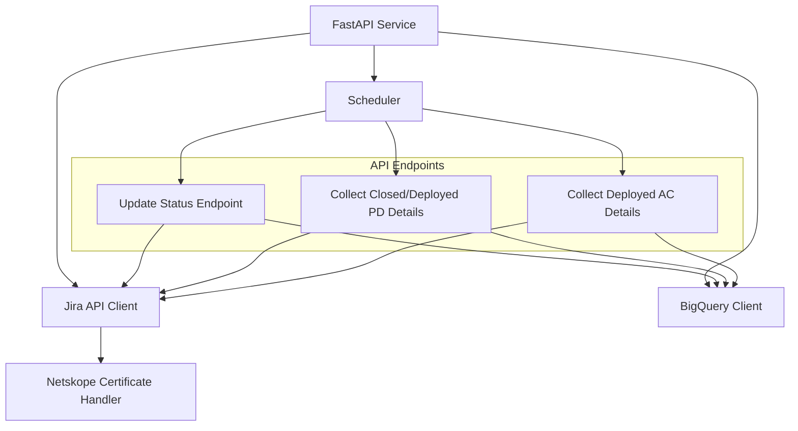

# Jira Logger with BigQuery Integration - Implementation Plan

This document outlines the comprehensive plan to implement a FastAPI service that will handle Jira issue tracking with BigQuery integration.

## System Architecture



## Components Overview

### 1. FastAPI Service
- Core service with three main endpoints corresponding to your three requests
- Includes middleware for authentication and error handling
- Provides API documentation via Swagger UI

### 2. Jira API Client
- Reuses and extends your existing Jira API integration code
- Handles SSL certificate management via the Netskope certificate module
- Implements pagination for handling large result sets

### 3. BigQuery Integration
- Uses Google Cloud Python client library
- Implements table creation if not exists
- Handles upsert operations to prevent duplicates
- Manages schema according to your requirements

### 4. Scheduler
- Optional component to trigger the endpoints on a daily basis
- Can be implemented using FastAPI's background tasks or external scheduler

## Implementation Details

### BigQuery Table Schema

```
Table: jira_issues
- issue_key (STRING, PRIMARY KEY)
- summary (STRING)
- status (STRING)
- project_ticket (STRING)
- planned_dev_start (TIMESTAMP)
- planned_dev_finish (TIMESTAMP)
- planned_duration (FLOAT)
- actual_start (TIMESTAMP)
- actual_finish (TIMESTAMP)
- actual_duration (FLOAT)
- details_updated_at (TIMESTAMP)
- last_updated_at (TIMESTAMP)
```

### API Endpoints

#### 1. Update Status Endpoint
- **Path**: `/api/update-status`
- **Method**: POST
- **Function**: Fetches all Jira issues with specified statuses and updates BigQuery
- **Implementation**:
  - Reuses code from `get_jira_issues_example.py`
  - Uses BigQuery MERGE operation for upsert
  - Updates `last_updated_at` timestamp

#### 2. Collect Closed/Deployed PD Details
- **Path**: `/api/collect-closed-details`
- **Method**: POST
- **Function**: Collects details for issues in "closed" or "deployed pd" status with empty details
- **Implementation**:
  - Queries BigQuery for issues with empty details
  - Uses `parser.py` functionality to collect details
  - Updates only the details columns in BigQuery

#### 3. Collect Deployed AC Details
- **Path**: `/api/collect-ac-details`
- **Method**: POST
- **Function**: Collects/updates details for issues in "deployed ac" status
- **Implementation**:
  - Similar to endpoint 2 but for "deployed ac" status
  - Updates details regardless of whether they exist

### Duplicate Prevention Strategy

1. **Unique Key Constraint**: Use issue_key as the primary key in BigQuery
2. **MERGE Operations**: Use BigQuery's MERGE (upsert) operations instead of INSERT
3. **Selective Updates**: Only update the columns that need to be changed
4. **Timestamp Tracking**: Track when details were last updated

## Required Dependencies

Additional dependencies to add to requirements.txt:
```
fastapi
uvicorn
google-cloud-bigquery
pydantic
```

## Implementation Plan

### Phase 1: Setup and Core Components
1. Set up FastAPI project structure
2. Implement BigQuery client and table creation
3. Create base Jira API client extending your existing code

### Phase 2: Endpoint Implementation
1. Implement Update Status endpoint
2. Implement Collect Closed/Deployed PD Details endpoint
3. Implement Collect Deployed AC Details endpoint

### Phase 3: Testing and Deployment
1. Create test cases for each endpoint
2. Implement error handling and logging
3. Set up deployment configuration

## Implemented File Structure

The Jira Logger project has been restructured to improve maintainability, scalability, and code organization. The new file structure is as follows:

```
jira_logger/
│
├── api/                          # API-related code
│   ├── __init__.py
│   ├── endpoints.py              # API endpoint definitions
│   ├── models.py                 # Pydantic models for request/response
│   └── middleware.py             # API middleware (error handling, etc.)
│
├── core/                         # Core business logic
│   ├── __init__.py
│   ├── jira/                     # Jira integration
│   │   ├── __init__.py
│   │   ├── client.py             # Jira API client (from jira_api_helper.py)
│   │   └── parser.py             # Jira data parser (from parser.py)
│   │
│   ├── bigquery/                 # BigQuery integration
│   │   ├── __init__.py
│   │   ├── client.py             # BigQuery client
│   │   └── schema.py             # BigQuery table schema definitions
│   │
│   └── scheduler.py              # Scheduling logic (from schedule_api_calls.py)
│
├── utils/                        # Utility functions and helpers
│   ├── __init__.py
│   ├── ssl_utils.py              # SSL certificate handling (from netskope_certificate.py)
│   ├── date_utils.py             # Date manipulation utilities
│   └── logging.py                # Logging configuration
│
├── data/                         # Data storage
│   ├── jira_raw_responses/       # Raw JSON responses from Jira
│   └── jira_issues/              # Processed Jira issues
│
├── scripts/                      # Standalone scripts
│   ├── save_jira_responses.py    # Script to save Jira responses
│   ├── setup_google_cloud.py     # Google Cloud setup script
│   └── test_scripts/             # Test scripts
│       ├── test_api.py
│       └── test_bigquery_connection.py
│
├── docs/                         # Documentation
│   ├── PRD.md                    # Product Requirements Document
│   ├── deployment_guide.md       # Deployment guide
│   ├── implementation_plan.md    # Implementation plan
│   └── api_docs.md               # API documentation
│
├── config/                       # Configuration files
│   ├── __init__.py
│   ├── settings.py               # Application settings
│   └── environment.py            # Environment-specific settings
│
├── main.py                       # Application entry point
└── run_api.py                    # API server runner
```

In the root directory, the following files are maintained for backward compatibility:
- `main.py`: Imports and uses the jira_logger/main.py file
- `run_api.py`: Imports and uses the jira_logger/run_api.py file
- `save_jira_responses.py`: Imports and uses the jira_logger/scripts/save_jira_responses.py file
- `setup_google_cloud.py`: Imports and uses the jira_logger/scripts/setup_google_cloud.py file
- `test_api.py`: Imports and uses the jira_logger/scripts/test_scripts/test_api.py file
- `test_bigquery_connection.py`: Imports and uses the jira_logger/scripts/test_scripts/test_bigquery_connection.py file

This structure makes the codebase more maintainable, scalable, and easier to understand for new developers joining the project.
